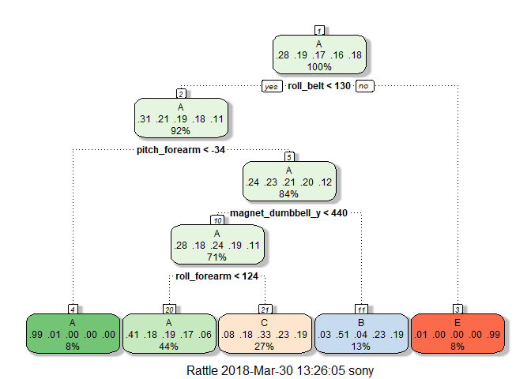
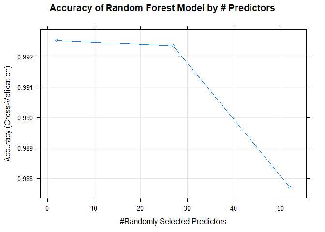
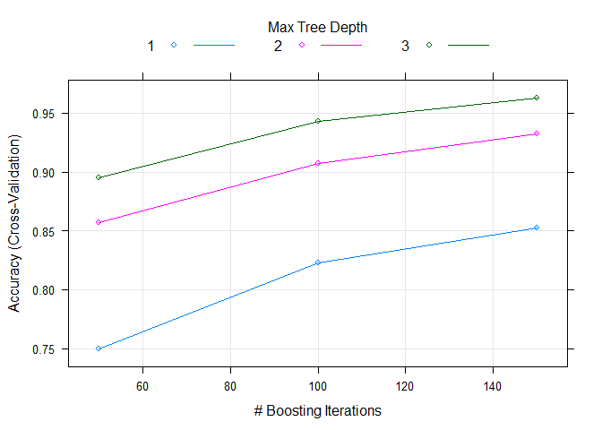

### Introduction and Executive Summary
Using devices such as Jawbone Up, Nike FuelBand, and Fitbit it is now possible to collect a large amount of data about personal activity relatively inexpensively. These types of devices are part of the quantified self movement - a group of enthusiasts who take measurements about themselves regularly to improve their health, to find patterns in their behavior, or because they are tech geeks. One thing that people regularly do is quantify how much of a particular activity they do, but they rarely quantify how well they do it. In this project, the goal will be to use data from accelerometers on the belt, forearm, arm, and dumbell of 6 participants. They were asked to perform barbell lifts correctly and incorrectly in 5 different ways. More information is available from the website here:
http://groupware.les.inf.puc-rio.br/har (see the section on the Weight Lifting Exercise Dataset).

The goal of the project is to predict the manner in which 20 test cases did the exercise. This is the "classe" variable in the training set which can take on the classes A,B,C,D,E.

### Data 
The data for this project come from this source: 

http://groupware.les.inf.puc-rio.br/har.

As in all machine learning projects, we will be using the Training set to train the model (We will actually partition this training data into 2 sets).

The training data for this project are available here: 

https://d396qusza40orc.cloudfront.net/predmachlearn/pml-training.csv

The test data is available here:  

https://d396qusza40orc.cloudfront.net/predmachlearn/pml-testing.csv

Note that we will use the Test dataset as a means to validate the accuracy of the predictions.

The data should be downloaded and stored before reproducing the codes below.

###  Partitioning and Clearning the Datasets

Let us first load the already downloaded datasets within the R environment.  Note that you will need to edit this code to adjust for where you have kept the datasets.


```r
setwd("C:/Users/sony/Desktop/datascience/Machine Learning")
training <- read.csv("C:/Users/sony/Desktop/datascience/Machine Learning/pml-training.csv", na.strings=c("NA","#DIV/0!",""))
testing <- read.csv("C:/Users/sony/Desktop/datascience/Machine Learning/pml-testing.csv", na.strings=c("NA","#DIV/0!",""))
```

We will also load all relevant R packages required to conduct Machine Learning and analyse the characteristics (str) of the training dataset.


```r
library(caret)
```

```
## Warning: package 'caret' was built under R version 3.4.4
```

```
## Loading required package: lattice
```

```
## Loading required package: ggplot2
```

```r
library(rpart)
library(rpart.plot)
```

```
## Warning: package 'rpart.plot' was built under R version 3.4.4
```

```r
library(RColorBrewer)
library(rattle)
```

```
## Warning: package 'rattle' was built under R version 3.4.4
```

```
## Rattle: A free graphical interface for data science with R.
## Version 5.1.0 Copyright (c) 2006-2017 Togaware Pty Ltd.
## Type 'rattle()' to shake, rattle, and roll your data.
```

```r
library(randomForest)
```

```
## Warning: package 'randomForest' was built under R version 3.4.4
```

```
## randomForest 4.6-14
```

```
## Type rfNews() to see new features/changes/bug fixes.
```

```
## 
## Attaching package: 'randomForest'
```

```
## The following object is masked from 'package:rattle':
## 
##     importance
```

```
## The following object is masked from 'package:ggplot2':
## 
##     margin
```

```r
# library(knitr)  #  Note the use of R Markdown with Knitr

str(training)
```

```
## 'data.frame':	19622 obs. of  160 variables:
##  $ X                       : int  1 2 3 4 5 6 7 8 9 10 ...
##  $ user_name               : Factor w/ 6 levels "adelmo","carlitos",..: 2 2 2 2 2 2 2 2 2 2 ...
##  $ raw_timestamp_part_1    : int  1323084231 1323084231 1323084231 1323084232 1323084232 1323084232 1323084232 1323084232 1323084232 1323084232 ...
##  $ raw_timestamp_part_2    : int  788290 808298 820366 120339 196328 304277 368296 440390 484323 484434 ...
##  $ cvtd_timestamp          : Factor w/ 20 levels "02/12/2011 13:32",..: 9 9 9 9 9 9 9 9 9 9 ...
##  $ new_window              : Factor w/ 2 levels "no","yes": 1 1 1 1 1 1 1 1 1 1 ...
##  $ num_window              : int  11 11 11 12 12 12 12 12 12 12 ...
##  $ roll_belt               : num  1.41 1.41 1.42 1.48 1.48 1.45 1.42 1.42 1.43 1.45 ...
##  $ pitch_belt              : num  8.07 8.07 8.07 8.05 8.07 8.06 8.09 8.13 8.16 8.17 ...
##  $ yaw_belt                : num  -94.4 -94.4 -94.4 -94.4 -94.4 -94.4 -94.4 -94.4 -94.4 -94.4 ...
##  $ total_accel_belt        : int  3 3 3 3 3 3 3 3 3 3 ...
##  $ kurtosis_roll_belt      : num  NA NA NA NA NA NA NA NA NA NA ...
##  $ kurtosis_picth_belt     : num  NA NA NA NA NA NA NA NA NA NA ...
##  $ kurtosis_yaw_belt       : logi  NA NA NA NA NA NA ...
##  $ skewness_roll_belt      : num  NA NA NA NA NA NA NA NA NA NA ...
##  $ skewness_roll_belt.1    : num  NA NA NA NA NA NA NA NA NA NA ...
##  $ skewness_yaw_belt       : logi  NA NA NA NA NA NA ...
##  $ max_roll_belt           : num  NA NA NA NA NA NA NA NA NA NA ...
##  $ max_picth_belt          : int  NA NA NA NA NA NA NA NA NA NA ...
##  $ max_yaw_belt            : num  NA NA NA NA NA NA NA NA NA NA ...
##  $ min_roll_belt           : num  NA NA NA NA NA NA NA NA NA NA ...
##  $ min_pitch_belt          : int  NA NA NA NA NA NA NA NA NA NA ...
##  $ min_yaw_belt            : num  NA NA NA NA NA NA NA NA NA NA ...
##  $ amplitude_roll_belt     : num  NA NA NA NA NA NA NA NA NA NA ...
##  $ amplitude_pitch_belt    : int  NA NA NA NA NA NA NA NA NA NA ...
##  $ amplitude_yaw_belt      : num  NA NA NA NA NA NA NA NA NA NA ...
##  $ var_total_accel_belt    : num  NA NA NA NA NA NA NA NA NA NA ...
##  $ avg_roll_belt           : num  NA NA NA NA NA NA NA NA NA NA ...
##  $ stddev_roll_belt        : num  NA NA NA NA NA NA NA NA NA NA ...
##  $ var_roll_belt           : num  NA NA NA NA NA NA NA NA NA NA ...
##  $ avg_pitch_belt          : num  NA NA NA NA NA NA NA NA NA NA ...
##  $ stddev_pitch_belt       : num  NA NA NA NA NA NA NA NA NA NA ...
##  $ var_pitch_belt          : num  NA NA NA NA NA NA NA NA NA NA ...
##  $ avg_yaw_belt            : num  NA NA NA NA NA NA NA NA NA NA ...
##  $ stddev_yaw_belt         : num  NA NA NA NA NA NA NA NA NA NA ...
##  $ var_yaw_belt            : num  NA NA NA NA NA NA NA NA NA NA ...
##  $ gyros_belt_x            : num  0 0.02 0 0.02 0.02 0.02 0.02 0.02 0.02 0.03 ...
##  $ gyros_belt_y            : num  0 0 0 0 0.02 0 0 0 0 0 ...
##  $ gyros_belt_z            : num  -0.02 -0.02 -0.02 -0.03 -0.02 -0.02 -0.02 -0.02 -0.02 0 ...
##  $ accel_belt_x            : int  -21 -22 -20 -22 -21 -21 -22 -22 -20 -21 ...
##  $ accel_belt_y            : int  4 4 5 3 2 4 3 4 2 4 ...
##  $ accel_belt_z            : int  22 22 23 21 24 21 21 21 24 22 ...
##  $ magnet_belt_x           : int  -3 -7 -2 -6 -6 0 -4 -2 1 -3 ...
##  $ magnet_belt_y           : int  599 608 600 604 600 603 599 603 602 609 ...
##  $ magnet_belt_z           : int  -313 -311 -305 -310 -302 -312 -311 -313 -312 -308 ...
##  $ roll_arm                : num  -128 -128 -128 -128 -128 -128 -128 -128 -128 -128 ...
##  $ pitch_arm               : num  22.5 22.5 22.5 22.1 22.1 22 21.9 21.8 21.7 21.6 ...
##  $ yaw_arm                 : num  -161 -161 -161 -161 -161 -161 -161 -161 -161 -161 ...
##  $ total_accel_arm         : int  34 34 34 34 34 34 34 34 34 34 ...
##  $ var_accel_arm           : num  NA NA NA NA NA NA NA NA NA NA ...
##  $ avg_roll_arm            : num  NA NA NA NA NA NA NA NA NA NA ...
##  $ stddev_roll_arm         : num  NA NA NA NA NA NA NA NA NA NA ...
##  $ var_roll_arm            : num  NA NA NA NA NA NA NA NA NA NA ...
##  $ avg_pitch_arm           : num  NA NA NA NA NA NA NA NA NA NA ...
##  $ stddev_pitch_arm        : num  NA NA NA NA NA NA NA NA NA NA ...
##  $ var_pitch_arm           : num  NA NA NA NA NA NA NA NA NA NA ...
##  $ avg_yaw_arm             : num  NA NA NA NA NA NA NA NA NA NA ...
##  $ stddev_yaw_arm          : num  NA NA NA NA NA NA NA NA NA NA ...
##  $ var_yaw_arm             : num  NA NA NA NA NA NA NA NA NA NA ...
##  $ gyros_arm_x             : num  0 0.02 0.02 0.02 0 0.02 0 0.02 0.02 0.02 ...
##  $ gyros_arm_y             : num  0 -0.02 -0.02 -0.03 -0.03 -0.03 -0.03 -0.02 -0.03 -0.03 ...
##  $ gyros_arm_z             : num  -0.02 -0.02 -0.02 0.02 0 0 0 0 -0.02 -0.02 ...
##  $ accel_arm_x             : int  -288 -290 -289 -289 -289 -289 -289 -289 -288 -288 ...
##  $ accel_arm_y             : int  109 110 110 111 111 111 111 111 109 110 ...
##  $ accel_arm_z             : int  -123 -125 -126 -123 -123 -122 -125 -124 -122 -124 ...
##  $ magnet_arm_x            : int  -368 -369 -368 -372 -374 -369 -373 -372 -369 -376 ...
##  $ magnet_arm_y            : int  337 337 344 344 337 342 336 338 341 334 ...
##  $ magnet_arm_z            : int  516 513 513 512 506 513 509 510 518 516 ...
##  $ kurtosis_roll_arm       : num  NA NA NA NA NA NA NA NA NA NA ...
##  $ kurtosis_picth_arm      : num  NA NA NA NA NA NA NA NA NA NA ...
##  $ kurtosis_yaw_arm        : num  NA NA NA NA NA NA NA NA NA NA ...
##  $ skewness_roll_arm       : num  NA NA NA NA NA NA NA NA NA NA ...
##  $ skewness_pitch_arm      : num  NA NA NA NA NA NA NA NA NA NA ...
##  $ skewness_yaw_arm        : num  NA NA NA NA NA NA NA NA NA NA ...
##  $ max_roll_arm            : num  NA NA NA NA NA NA NA NA NA NA ...
##  $ max_picth_arm           : num  NA NA NA NA NA NA NA NA NA NA ...
##  $ max_yaw_arm             : int  NA NA NA NA NA NA NA NA NA NA ...
##  $ min_roll_arm            : num  NA NA NA NA NA NA NA NA NA NA ...
##  $ min_pitch_arm           : num  NA NA NA NA NA NA NA NA NA NA ...
##  $ min_yaw_arm             : int  NA NA NA NA NA NA NA NA NA NA ...
##  $ amplitude_roll_arm      : num  NA NA NA NA NA NA NA NA NA NA ...
##  $ amplitude_pitch_arm     : num  NA NA NA NA NA NA NA NA NA NA ...
##  $ amplitude_yaw_arm       : int  NA NA NA NA NA NA NA NA NA NA ...
##  $ roll_dumbbell           : num  13.1 13.1 12.9 13.4 13.4 ...
##  $ pitch_dumbbell          : num  -70.5 -70.6 -70.3 -70.4 -70.4 ...
##  $ yaw_dumbbell            : num  -84.9 -84.7 -85.1 -84.9 -84.9 ...
##  $ kurtosis_roll_dumbbell  : num  NA NA NA NA NA NA NA NA NA NA ...
##  $ kurtosis_picth_dumbbell : num  NA NA NA NA NA NA NA NA NA NA ...
##  $ kurtosis_yaw_dumbbell   : logi  NA NA NA NA NA NA ...
##  $ skewness_roll_dumbbell  : num  NA NA NA NA NA NA NA NA NA NA ...
##  $ skewness_pitch_dumbbell : num  NA NA NA NA NA NA NA NA NA NA ...
##  $ skewness_yaw_dumbbell   : logi  NA NA NA NA NA NA ...
##  $ max_roll_dumbbell       : num  NA NA NA NA NA NA NA NA NA NA ...
##  $ max_picth_dumbbell      : num  NA NA NA NA NA NA NA NA NA NA ...
##  $ max_yaw_dumbbell        : num  NA NA NA NA NA NA NA NA NA NA ...
##  $ min_roll_dumbbell       : num  NA NA NA NA NA NA NA NA NA NA ...
##  $ min_pitch_dumbbell      : num  NA NA NA NA NA NA NA NA NA NA ...
##  $ min_yaw_dumbbell        : num  NA NA NA NA NA NA NA NA NA NA ...
##  $ amplitude_roll_dumbbell : num  NA NA NA NA NA NA NA NA NA NA ...
##   [list output truncated]
```

```r
str(testing)
```

```
## 'data.frame':	20 obs. of  160 variables:
##  $ X                       : int  1 2 3 4 5 6 7 8 9 10 ...
##  $ user_name               : Factor w/ 6 levels "adelmo","carlitos",..: 6 5 5 1 4 5 5 5 2 3 ...
##  $ raw_timestamp_part_1    : int  1323095002 1322673067 1322673075 1322832789 1322489635 1322673149 1322673128 1322673076 1323084240 1322837822 ...
##  $ raw_timestamp_part_2    : int  868349 778725 342967 560311 814776 510661 766645 54671 916313 384285 ...
##  $ cvtd_timestamp          : Factor w/ 11 levels "02/12/2011 13:33",..: 5 10 10 1 6 11 11 10 3 2 ...
##  $ new_window              : Factor w/ 1 level "no": 1 1 1 1 1 1 1 1 1 1 ...
##  $ num_window              : int  74 431 439 194 235 504 485 440 323 664 ...
##  $ roll_belt               : num  123 1.02 0.87 125 1.35 -5.92 1.2 0.43 0.93 114 ...
##  $ pitch_belt              : num  27 4.87 1.82 -41.6 3.33 1.59 4.44 4.15 6.72 22.4 ...
##  $ yaw_belt                : num  -4.75 -88.9 -88.5 162 -88.6 -87.7 -87.3 -88.5 -93.7 -13.1 ...
##  $ total_accel_belt        : int  20 4 5 17 3 4 4 4 4 18 ...
##  $ kurtosis_roll_belt      : logi  NA NA NA NA NA NA ...
##  $ kurtosis_picth_belt     : logi  NA NA NA NA NA NA ...
##  $ kurtosis_yaw_belt       : logi  NA NA NA NA NA NA ...
##  $ skewness_roll_belt      : logi  NA NA NA NA NA NA ...
##  $ skewness_roll_belt.1    : logi  NA NA NA NA NA NA ...
##  $ skewness_yaw_belt       : logi  NA NA NA NA NA NA ...
##  $ max_roll_belt           : logi  NA NA NA NA NA NA ...
##  $ max_picth_belt          : logi  NA NA NA NA NA NA ...
##  $ max_yaw_belt            : logi  NA NA NA NA NA NA ...
##  $ min_roll_belt           : logi  NA NA NA NA NA NA ...
##  $ min_pitch_belt          : logi  NA NA NA NA NA NA ...
##  $ min_yaw_belt            : logi  NA NA NA NA NA NA ...
##  $ amplitude_roll_belt     : logi  NA NA NA NA NA NA ...
##  $ amplitude_pitch_belt    : logi  NA NA NA NA NA NA ...
##  $ amplitude_yaw_belt      : logi  NA NA NA NA NA NA ...
##  $ var_total_accel_belt    : logi  NA NA NA NA NA NA ...
##  $ avg_roll_belt           : logi  NA NA NA NA NA NA ...
##  $ stddev_roll_belt        : logi  NA NA NA NA NA NA ...
##  $ var_roll_belt           : logi  NA NA NA NA NA NA ...
##  $ avg_pitch_belt          : logi  NA NA NA NA NA NA ...
##  $ stddev_pitch_belt       : logi  NA NA NA NA NA NA ...
##  $ var_pitch_belt          : logi  NA NA NA NA NA NA ...
##  $ avg_yaw_belt            : logi  NA NA NA NA NA NA ...
##  $ stddev_yaw_belt         : logi  NA NA NA NA NA NA ...
##  $ var_yaw_belt            : logi  NA NA NA NA NA NA ...
##  $ gyros_belt_x            : num  -0.5 -0.06 0.05 0.11 0.03 0.1 -0.06 -0.18 0.1 0.14 ...
##  $ gyros_belt_y            : num  -0.02 -0.02 0.02 0.11 0.02 0.05 0 -0.02 0 0.11 ...
##  $ gyros_belt_z            : num  -0.46 -0.07 0.03 -0.16 0 -0.13 0 -0.03 -0.02 -0.16 ...
##  $ accel_belt_x            : int  -38 -13 1 46 -8 -11 -14 -10 -15 -25 ...
##  $ accel_belt_y            : int  69 11 -1 45 4 -16 2 -2 1 63 ...
##  $ accel_belt_z            : int  -179 39 49 -156 27 38 35 42 32 -158 ...
##  $ magnet_belt_x           : int  -13 43 29 169 33 31 50 39 -6 10 ...
##  $ magnet_belt_y           : int  581 636 631 608 566 638 622 635 600 601 ...
##  $ magnet_belt_z           : int  -382 -309 -312 -304 -418 -291 -315 -305 -302 -330 ...
##  $ roll_arm                : num  40.7 0 0 -109 76.1 0 0 0 -137 -82.4 ...
##  $ pitch_arm               : num  -27.8 0 0 55 2.76 0 0 0 11.2 -63.8 ...
##  $ yaw_arm                 : num  178 0 0 -142 102 0 0 0 -167 -75.3 ...
##  $ total_accel_arm         : int  10 38 44 25 29 14 15 22 34 32 ...
##  $ var_accel_arm           : logi  NA NA NA NA NA NA ...
##  $ avg_roll_arm            : logi  NA NA NA NA NA NA ...
##  $ stddev_roll_arm         : logi  NA NA NA NA NA NA ...
##  $ var_roll_arm            : logi  NA NA NA NA NA NA ...
##  $ avg_pitch_arm           : logi  NA NA NA NA NA NA ...
##  $ stddev_pitch_arm        : logi  NA NA NA NA NA NA ...
##  $ var_pitch_arm           : logi  NA NA NA NA NA NA ...
##  $ avg_yaw_arm             : logi  NA NA NA NA NA NA ...
##  $ stddev_yaw_arm          : logi  NA NA NA NA NA NA ...
##  $ var_yaw_arm             : logi  NA NA NA NA NA NA ...
##  $ gyros_arm_x             : num  -1.65 -1.17 2.1 0.22 -1.96 0.02 2.36 -3.71 0.03 0.26 ...
##  $ gyros_arm_y             : num  0.48 0.85 -1.36 -0.51 0.79 0.05 -1.01 1.85 -0.02 -0.5 ...
##  $ gyros_arm_z             : num  -0.18 -0.43 1.13 0.92 -0.54 -0.07 0.89 -0.69 -0.02 0.79 ...
##  $ accel_arm_x             : int  16 -290 -341 -238 -197 -26 99 -98 -287 -301 ...
##  $ accel_arm_y             : int  38 215 245 -57 200 130 79 175 111 -42 ...
##  $ accel_arm_z             : int  93 -90 -87 6 -30 -19 -67 -78 -122 -80 ...
##  $ magnet_arm_x            : int  -326 -325 -264 -173 -170 396 702 535 -367 -420 ...
##  $ magnet_arm_y            : int  385 447 474 257 275 176 15 215 335 294 ...
##  $ magnet_arm_z            : int  481 434 413 633 617 516 217 385 520 493 ...
##  $ kurtosis_roll_arm       : logi  NA NA NA NA NA NA ...
##  $ kurtosis_picth_arm      : logi  NA NA NA NA NA NA ...
##  $ kurtosis_yaw_arm        : logi  NA NA NA NA NA NA ...
##  $ skewness_roll_arm       : logi  NA NA NA NA NA NA ...
##  $ skewness_pitch_arm      : logi  NA NA NA NA NA NA ...
##  $ skewness_yaw_arm        : logi  NA NA NA NA NA NA ...
##  $ max_roll_arm            : logi  NA NA NA NA NA NA ...
##  $ max_picth_arm           : logi  NA NA NA NA NA NA ...
##  $ max_yaw_arm             : logi  NA NA NA NA NA NA ...
##  $ min_roll_arm            : logi  NA NA NA NA NA NA ...
##  $ min_pitch_arm           : logi  NA NA NA NA NA NA ...
##  $ min_yaw_arm             : logi  NA NA NA NA NA NA ...
##  $ amplitude_roll_arm      : logi  NA NA NA NA NA NA ...
##  $ amplitude_pitch_arm     : logi  NA NA NA NA NA NA ...
##  $ amplitude_yaw_arm       : logi  NA NA NA NA NA NA ...
##  $ roll_dumbbell           : num  -17.7 54.5 57.1 43.1 -101.4 ...
##  $ pitch_dumbbell          : num  25 -53.7 -51.4 -30 -53.4 ...
##  $ yaw_dumbbell            : num  126.2 -75.5 -75.2 -103.3 -14.2 ...
##  $ kurtosis_roll_dumbbell  : logi  NA NA NA NA NA NA ...
##  $ kurtosis_picth_dumbbell : logi  NA NA NA NA NA NA ...
##  $ kurtosis_yaw_dumbbell   : logi  NA NA NA NA NA NA ...
##  $ skewness_roll_dumbbell  : logi  NA NA NA NA NA NA ...
##  $ skewness_pitch_dumbbell : logi  NA NA NA NA NA NA ...
##  $ skewness_yaw_dumbbell   : logi  NA NA NA NA NA NA ...
##  $ max_roll_dumbbell       : logi  NA NA NA NA NA NA ...
##  $ max_picth_dumbbell      : logi  NA NA NA NA NA NA ...
##  $ max_yaw_dumbbell        : logi  NA NA NA NA NA NA ...
##  $ min_roll_dumbbell       : logi  NA NA NA NA NA NA ...
##  $ min_pitch_dumbbell      : logi  NA NA NA NA NA NA ...
##  $ min_yaw_dumbbell        : logi  NA NA NA NA NA NA ...
##  $ amplitude_roll_dumbbell : logi  NA NA NA NA NA NA ...
##   [list output truncated]
```

The created datasets have missing values which we call NA and zeroes.  We will elimate the variables with too many zeroes in order not to interfere with the Machine Learning algorithms.  We will also eliminate variables that have more than 80% of their observations as NA.  Finally we will also eliminate rows with variables that we will not be using for the purpose of predictions (identities of persons, dates etc i.e the first 7 columns).  We condut a similar clearning procedure for the testing dataset.


```r
Remove_Columns_NA <- which(colSums(is.na(training) |training=="")>0.8*dim(training)[1]) 
training_clean <- training[,-Remove_Columns_NA]
training_clean <- training_clean[,-c(1:7)]
dim(training_clean)
```

```
## [1] 19622    53
```

```r
indColToRemove <- which(colSums(is.na(testing) |testing=="")>0.8*dim(testing)[1]) 
testing_clean <- testing[,-indColToRemove]
testing_clean <- testing_clean[,-1]
dim(testing_clean)
```

```
## [1] 20 59
```

As previously highlighted, we will look to a. Create a training subset, b.  A testing subset within the training datafile and lastly use the testing dataset as the Validation dataset.  We breakdown the training data within a 80:20 mix.


```r
set.seed(12345)
inTrain <- createDataPartition(training_clean$classe, p=0.8, list=FALSE)
myTraining <- training_clean[inTrain, ]
myTesting <- training_clean[-inTrain, ]
dim(myTraining); dim(myTesting)
```

```
## [1] 15699    53
```

```
## [1] 3923   53
```

###  Using Various Machine Learning Algorithms For Training Purposes

Note that we are trying to predict the "classe" variable which defines different action types.

We will use Randowm Forest, Classification Trees , Linear Discriminant Analysus, Gradient Boosting Methods and not only select the best single model but also investigate whether an ensemble of the 3 best models can deliver better results in terms of accuracy within the mytesting dataset.  Due to the long  processing requirement, we will make use of parallel computing and K-fold classifications rather than bootstrapping for some of these models.  
In order to improve processing speeds, we will however call on the parallel computing packages.
This parallel computing code was provided curtesy of lgreski's github page.


```r
library(parallel)
library(doParallel)
```

```
## Warning: package 'doParallel' was built under R version 3.4.4
```

```
## Loading required package: foreach
```

```
## Warning: package 'foreach' was built under R version 3.4.4
```

```
## Loading required package: iterators
```

```r
cluster <- makeCluster(detectCores() - 1) # convention to leave 1 core for OS
registerDoParallel(cluster)
```

# Classification Trees
In order to limit the risk of overfitting and optimize run times, we will conduct cross validation with 5 K folds (can use 5 or 10 with the latter taking longer).  Typically classification trees are not the most accurate models to use but they do give us a good sense of how to proceed in terms of next steps and allows us to better understand the data.


```r
set.seed(12343)
control <- trainControl(method="cv", number=5, allowParallel = TRUE)
mod_CT <- train(classe~., data=myTraining, method="rpart", trControl=control)

fancyRpartPlot(mod_CT$finalModel)
```

<!-- -->

We can now run the model on the myTesting dataset.  If the model accuracy is high, we will use the actual testing dataset for validation.  If not we will need to look at other models.


```r
trainprediction <- predict(mod_CT,newdata=myTesting)

confusion <- confusionMatrix(myTesting$classe,trainprediction)
confusion$table
```

```
##           Reference
## Prediction    A    B    C    D    E
##          A 1008   15   89    0    4
##          B  331  246  182    0    0
##          C  297   21  366    0    0
##          D  305  106  232    0    0
##          E  111  101  191    0  318
```

```r
confusion$overall[1]
```

```
##  Accuracy 
## 0.4940097
```

We get a very low accuracy on the myTesting dataset itself of less than 50%.  This model is not a good predictor of classe.  

# 2.  Training Random Forest
This model is an extension of classification trees and is one of the most widely used algorithms in the field of Machine Learning.  

Process: 
1.  Bootstrap samples from training data (with         replacement)
2.  Split and bootstrap variables
3.  Grow trees (repeat split/bootstrap) and            vote/average final trees

Some of the drawbacks of Random Forest is its slow nature, the tendency to overfit models, the difficulty in figuring out which tree is responsible for this overfitting etc..  It remains important as is being done here to use cross validation.


```r
set.seed(12343)
mod_rf<-train(classe~., data=myTraining, method="rf", trControl=control)
print(mod_rf)
```

```
## Random Forest 
## 
## 15699 samples
##    52 predictor
##     5 classes: 'A', 'B', 'C', 'D', 'E' 
## 
## No pre-processing
## Resampling: Cross-Validated (5 fold) 
## Summary of sample sizes: 12559, 12560, 12558, 12560, 12559 
## Resampling results across tuning parameters:
## 
##   mtry  Accuracy   Kappa    
##    2    0.9925471  0.9905714
##   27    0.9923560  0.9903300
##   52    0.9877061  0.9844459
## 
## Accuracy was used to select the optimal model using the largest value.
## The final value used for the model was mtry = 2.
```

```r
plot(mod_rf,main="Accuracy of Random Forest Model by # Predictors")
```

<!-- -->

```r
varImp(mod_rf)
```

```
## rf variable importance
## 
##   only 20 most important variables shown (out of 52)
## 
##                   Overall
## roll_belt          100.00
## yaw_belt            83.82
## magnet_dumbbell_z   70.27
## pitch_belt          63.78
## pitch_forearm       62.70
## magnet_dumbbell_y   61.04
## magnet_dumbbell_x   53.43
## accel_belt_z        50.76
## roll_forearm        50.45
## accel_dumbbell_y    46.82
## magnet_belt_z       42.88
## magnet_belt_y       42.66
## roll_dumbbell       41.91
## accel_dumbbell_z    37.61
## roll_arm            35.72
## accel_forearm_x     34.76
## accel_dumbbell_x    30.67
## yaw_dumbbell        30.27
## gyros_dumbbell_y    29.69
## magnet_arm_x        27.25
```

We note that the algorithm achieves highest in traiinng accuracy with few predictors. There isn't a lot of loss in predictive power when adding or substracting variables as one would still have a high degree of in training sample predictibility with less than 3 predictors! We will now test the model with the myTest subset for accuracy


```r
predictrfmytest <- predict(mod_rf,newdata=myTesting)

confusionrf <- confusionMatrix(myTesting$classe,predictrfmytest)
confusionrf$table
```

```
##           Reference
## Prediction    A    B    C    D    E
##          A 1116    0    0    0    0
##          B    4  754    1    0    0
##          C    0   11  673    0    0
##          D    0    0   15  628    0
##          E    0    0    0    1  720
```

```r
confusionrf$overall[1]
```

```
## Accuracy 
## 0.991843
```

#  3. Using Boosting

Along with Random Forest, boosting (GBM in our case) is one of the more accurate prediction models that exist today.  

Process: Take a group of weak predictors, weight them and add them up.  Result is  a stronger predictor. 


```r
set.seed(12343)
mod_gbm <- train(classe~., data=myTraining, method="gbm", trControl=control, verbose=FALSE)
print(mod_gbm)
```

```
## Stochastic Gradient Boosting 
## 
## 15699 samples
##    52 predictor
##     5 classes: 'A', 'B', 'C', 'D', 'E' 
## 
## No pre-processing
## Resampling: Cross-Validated (5 fold) 
## Summary of sample sizes: 12559, 12560, 12558, 12560, 12559 
## Resampling results across tuning parameters:
## 
##   interaction.depth  n.trees  Accuracy   Kappa    
##   1                   50      0.7496008  0.6825695
##   1                  100      0.8225363  0.7753871
##   1                  150      0.8527291  0.8136394
##   2                   50      0.8573156  0.8192178
##   2                  100      0.9072554  0.8826464
##   2                  150      0.9322257  0.9142407
##   3                   50      0.8948978  0.8669022
##   3                  100      0.9431174  0.9280330
##   3                  150      0.9631826  0.9534264
## 
## Tuning parameter 'shrinkage' was held constant at a value of 0.1
## 
## Tuning parameter 'n.minobsinnode' was held constant at a value of 10
## Accuracy was used to select the optimal model using the largest value.
## The final values used for the model were n.trees = 150,
##  interaction.depth = 3, shrinkage = 0.1 and n.minobsinnode = 10.
```

```r
plot(mod_gbm)
```

<!-- -->

Checking Model Accuracy with myTesting we get

```r
predictgbmmytest <- predict(mod_gbm,newdata=myTesting)

confusiongbm <- confusionMatrix(myTesting$classe,predictgbmmytest)
print(confusiongbm)
```

```
## Confusion Matrix and Statistics
## 
##           Reference
## Prediction    A    B    C    D    E
##          A 1100   12    3    1    0
##          B   28  713   17    1    0
##          C    0   26  649    6    3
##          D    0    2   24  612    5
##          E    1    9    1    9  701
## 
## Overall Statistics
##                                          
##                Accuracy : 0.9623         
##                  95% CI : (0.9558, 0.968)
##     No Information Rate : 0.2878         
##     P-Value [Acc > NIR] : < 2.2e-16      
##                                          
##                   Kappa : 0.9523         
##  Mcnemar's Test P-Value : 0.0001002      
## 
## Statistics by Class:
## 
##                      Class: A Class: B Class: C Class: D Class: E
## Sensitivity            0.9743   0.9357   0.9352   0.9730   0.9887
## Specificity            0.9943   0.9854   0.9892   0.9906   0.9938
## Pos Pred Value         0.9857   0.9394   0.9488   0.9518   0.9723
## Neg Pred Value         0.9897   0.9845   0.9861   0.9948   0.9975
## Prevalence             0.2878   0.1942   0.1769   0.1603   0.1807
## Detection Rate         0.2804   0.1817   0.1654   0.1560   0.1787
## Detection Prevalence   0.2845   0.1935   0.1744   0.1639   0.1838
## Balanced Accuracy      0.9843   0.9606   0.9622   0.9818   0.9912
```

```r
confusiongbm$table
```

```
##           Reference
## Prediction    A    B    C    D    E
##          A 1100   12    3    1    0
##          B   28  713   17    1    0
##          C    0   26  649    6    3
##          D    0    2   24  612    5
##          E    1    9    1    9  701
```
The GBM model demonstrates a high degree of accuracy but less than RF.

# 4. Training with LDA Model
Linear Discriminant Analysis is an example of a model based prediction which assumes that the data follows a probabilistic model/distribution (LDA =Gaussian) and uses Bayes' theorem to identify optimal classifiers/variables that can potentially take advantage of the structure of the data which in turn could help reduce computational complexity (reduce variables).  LDA and Naive Bayes can be reasonably accurate on real problems although this approach does make additional assumptions about the data, which can lead to model failure/reduced accuracy if they are too far off.


```r
set.seed(12343)
mod_lda <- train(classe~., data=myTraining, method="lda", trControl=control, verbose=FALSE)
mod_lda$results
```

```
##   parameter Accuracy    Kappa AccuracySD    KappaSD
## 1      none 0.701699 0.622474 0.01268511 0.01622169
```

```r
predictldamytest<-predict(mod_lda,newdata=myTesting)
```

The LDA approach leads to an accuracy slightly in excess of 70% in predicting myTraining casse predictions.  The LDA approach leads to better accuracy than with using classification trees but it does not beat GBM or Random Forest.


###  Model Combination Using Ensembling Approach
While the Random Forest Model appears to be the better model, we would like to check whether an odd combination of the 3 best models namely RF, GBM and LDA (the latter being a distant third) could add to overall accuracy in predicting the test/validation dataset.  Combining predictors = also known as ensembling methods in learning, combine classifiers by averaging/voting to improve accuracy (generally) although such methods add to scalability issues given the heavier computational requirements.

We will follow the following steps

Combine the Prediction Results and the Actual Classe variable into a New Data Frame


```r
combinedTestData <- data.frame(gbm.pred=predictgbmmytest,
    rf.pred =predictrfmytest,lda.pred=predictldamytest,classe=myTesting$classe)
```

We now run a Random Forest Model on the combined test data.  


```r
comb.fit <- train(classe ~.,method="rf",data=combinedTestData,trControl=control)
print(comb.fit)
```

```
## Random Forest 
## 
## 3923 samples
##    3 predictor
##    5 classes: 'A', 'B', 'C', 'D', 'E' 
## 
## No pre-processing
## Resampling: Cross-Validated (5 fold) 
## Summary of sample sizes: 3138, 3138, 3139, 3139, 3138 
## Resampling results across tuning parameters:
## 
##   mtry  Accuracy   Kappa    
##    2    0.9918439  0.9896805
##    7    0.9915891  0.9893582
##   12    0.9915891  0.9893582
## 
## Accuracy was used to select the optimal model using the largest value.
## The final value used for the model was mtry = 2.
```

We now use the comb.fit model to predict on the myTesting dataset.


```r
comb.pred.test <- predict(comb.fit, combinedTestData)
```

Now use the LDA, rf and GBM models to predict classe on the validation dataset known here as testing_clean.  We then create a new data frame with the 3 predictions.  Note here that in the testing_clean dataset, there is no classe variable.


```r
lda.pred.val<-predict(mod_lda,newdata=testing_clean)
gbm.pred.val<-predict(mod_gbm,newdata=testing_clean)
rf.pred.val<-predict(mod_rf,newdata=testing_clean)

combinedValData <- data.frame(gbm.pred=gbm.pred.val,rf.pred=rf.pred.val,lda.pred=lda.pred.val)
```

Run the comb.fit on the combined validation data

```r
comb.pred.val <- predict(comb.fit,combinedValData)

print(comb.pred.val)
```

```
##  [1] B A B A A E D B A A B C B A E E A B B B
## Levels: A B C D E
```

```r
print(rf.pred.val)
```

```
##  [1] B A B A A E D B A A B C B A E E A B B B
## Levels: A B C D E
```


    
We can now shutdown the cluster and return the OS to its original state.

```r
stopCluster(cluster)
registerDoSEQ()
```


After clearning and partitioning the datasets, we have run multiple models, classification trees which typically generate poor results and have done so here, random forests which is an ensemble of classification trees, linear discriminant analysis model, the GBM model and an ensemble of the latter 3 best models to predict classe.   We fimd that for the added computational complexity, a combined model in this case does not really improve predictability vs. the random forest model. Hence, we choose the RF model as our baseline model to predict classe.
